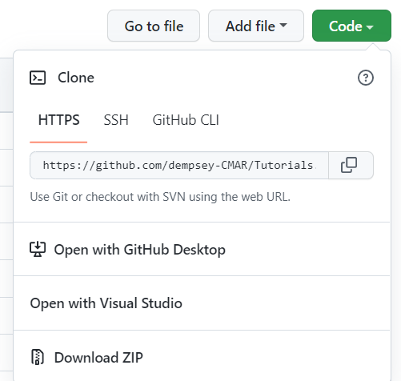
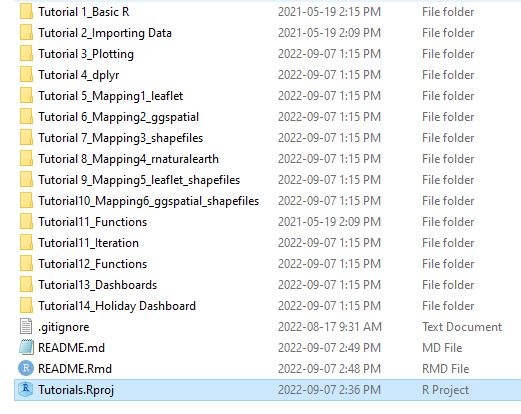

<!-- README.md is generated from README.Rmd. Please edit that file -->

```{r, include = FALSE}
knitr::opts_chunk$set(
  collapse = TRUE,
  comment = "#>"
)
```

# Tutorials

Welcome to the CMAR R Tutorials Repository!

These tutorials provide a brief introduction to R and some useful packages. Topics include basics, importing data, plotting, dplyr, mapping, iteration, functions, dashboards, and more. The tutorials were originally developed to help employees of the [Centre for Marine Applied Research](https://cmar.ca/) (CMAR) with varying levels of coding experience improve their R skills. 

Prerequisites: we assume you already have [R](https://www.r-project.org/) and [RStudio](https://posit.co/downloads/) downloaded and installed on your computer.

To do the tutorials, download this repository to your own computer by clicking the green "Code" button and choosing "Download ZIP" (Figure 1). Extract the files to the location of your choice on your computer. Double click the "Tutorials.Rproj" file to open the project (Figure 2). Each tutorial folder contains all of the necessary code files and data. To make sure the file paths in the tutorials are correct, always do the tutorials with the project open, and do not remove the tutorial folders from your local repository.


<br>
```{r fig1, echo = FALSE, out.width="50%", fig.align='center'}



```
Figure 1: Click the green Code button and "Download ZIP" to download the repository onto your computer.

<br>


<br>
```{r, echo = FALSE, out.width="50%", fig.align='center'}



```
Figure 2: Open the Tutorials project and follow the instructions in each folder.

<br>
<br>

If you have any questions or comments about the tutorials, please ask Danielle or create a new [issue](https://github.com/dempsey-CMAR/Tutorials/issues) on GitHub.

